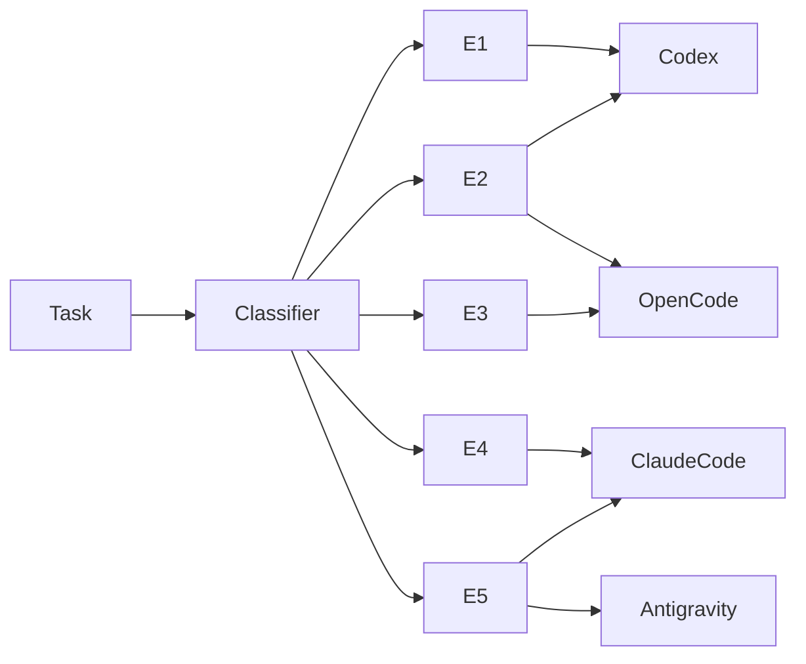

# LifeOS Algorithm

## Overview

The LifeOS Algorithm is the **task routing and dispatch system** that bridges [[concepts/AI Agents|all 7 AI agents]] into a unified pipeline. When a task arrives, the algorithm classifies it by complexity tier (E1–E5) and routes it to the agent best suited for that level of work.

Created during the [[journal/2026-07-13-second-brain-integration-session|July 13 integration session]], the algorithm is implemented by `hermes_router.py` — a Python script that serves as the orchestration brain, dispatching tasks through `lifeos_client.py` (LifeOS Pulse connector) or a keyword-based fallback classifier when Pulse is offline.

---

## Architecture

```
┌─────────────┐     ┌──────────────────┐     ┌──────────────────────┐
│  Task Input  │────▶│   hermes_router  │────▶│   Target Agent       │
│  (CLI / API) │     │   .py            │     │   (Codex / OpenCode  │
└─────────────┘     │                  │     │    / Claude / etc.)  │
                    │  ┌────────────┐  │     └──────────────────────┘
                    │  │ classifier │  │
                    │  │   ┌──────┐ │  │
                    │  │   │Pulse │ │  │     ┌──────────────────────┐
                    │  │   │ API  │─│──┼────▶│   LifeOS Pulse       │
                    │  │   └──┬───┘ │  │     │   localhost:31337    │
                    │  │      ▼     │  │     └──────────────────────┘
                    │  │ ┌────────┐ │  │
                    │  │ │Keyword │ │  │
                    │  │ │Fallback│ │  │
                    │  │ └────────┘ │  │
                    │  └────────────┘  │
                    └──────────────────┘
```

### Components

| Component | File | Role |
|-----------|------|------|
| **hermes_router.py** | `second-brain/scripts/hermes_router.py` | Task classifier + dispatcher. Routes tasks by tier. |
| **lifeos_client.py** | `second-brain/scripts/lifeos_client.py` | Pulse API client. Connects to LifeOS daemon at port 31337. |
| **hermes** (bash) | `second-brain/scripts/hermes` | Bash wrapper for CLI invocation. |
| **Skill config** | `06_STATE/configs/second-brain-skill.md` | Declares triggers, tools, and vault mapping. |

---

## Tier Classification: E1 → E5



### The Routing Matrix

```
Task arrives → classify tier → route:
  E1 (trivial)    → Codex         (fast edit, --quiet)
  E2 (simple)     → Codex/OpenCode (scaffold, boilerplate)
  E3 (moderate)   → OpenCode      (build, refactor)
  E4 (complex)    → Claude Code   (deep reasoning, + web search)
  E5 (creative)   → Claude Code   (Dolphin mode, + Antigravity synthesis)
```

| Tier | Complexity | Agent | Example Tasks |
|------|-----------|-------|---------------|
| **E1** | Trivial | Codex (`codex --quiet`) | Typo fixes, config value changes, single-line edits |
| **E2** | Simple | Codex / OpenCode | Boilerplate generation, scaffold creation, small refactors |
| **E3** | Moderate | OpenCode | Feature builds, file writes, vault restructure, session capture |
| **E4** | Complex | Claude Code (+ web search) | Architecture decisions, multi-file refactors, research-heavy tasks |
| **E5** | Creative | Claude Code (Dolphin mode) + Antigravity | Novel solutions, unconventional approaches, creative synthesis |

### Keyword Fallback Classifier

When LifeOS Pulse is unreachable (daemon not running), the classifier falls back to keyword matching against the task description:

| Keyword Pattern | Tier |
|----------------|------|
| `quick\|fix\|typo\|tweak` | E1 |
| `scaffold\|boilerplate\|setup\|init` | E2 |
| `build\|refactor\|implement\|create\|write` | E3 |
| `architect\|design\|research\|analyze\|compare` | E4 |
| `invent\|create\|novel\|synthesis\|reimagine` | E5 |

**Critical design note:** The keyword classifier handles all 5 tiers correctly with zero external dependencies. LifeOS Pulse adds context-aware classification but is not a hard requirement — the system degrades gracefully.

---

## Dependency Chain

The scripts have a strict build order. Running them out of sequence breaks imports:

```
1. lifeos_client.py        (Pulse API client, no deps)
2. hermes_router.py        (imports lifeos_client)
3. hermes (bash wrapper)   (calls hermes_router)
4. poznote_pipeline.py     (uses hermes_router for task routing)
5. poznote_watch.sh        (cron wrapper around pipeline)
```

---

## LifeOS Pulse API

The LifeOS Pulse daemon runs on `localhost:31337` and provides these endpoints used by the algorithm:

| Endpoint | Method | Purpose |
|----------|--------|---------|
| `/api/memory/{bucket}` | GET | List vault entries in a memory bucket |
| `/api/memory/{bucket}` | POST | Create entry (writes to vault + Memory) |
| `/api/memory/search?q=` | GET | Full-text search across all buckets |
| `/api/algorithm/step` | POST | Trigger OBSERVE → THINK → PLAN cycle |
| `/api/pulse/status` | GET | Daemon health check |

### Skill Actions (via second-brain-skill config)

| Action | Signature | Purpose |
|--------|-----------|---------|
| `vault_read` | `(bucket, query?)` | Read entries from bucket. Optionally grep for matches. |
| `vault_write` | `(bucket, title, content, tags)` | Create markdown file with frontmatter in correct bucket. |
| `memory_sync` | `()` | Bidirectional sync: push vault files → LifeOS Memory, pull Memory → vault. |
| `algorithm_trigger` | `(context)` | Feed entry into LifeOS Algorithm loop starting at OBSERVE step. |

---

## Hooks

The skill config declares three automation hooks that wire captures, vault writes, and algorithm completions together:

```json
{
  "on_capture": {
    "trigger": "new_file_in_raw",
    "action": "classify_and_route",
    "handler": "poznote_pipeline.py"
  },
  "on_vault_write": {
    "trigger": "file_written_to_vault",
    "action": "sync_to_memory",
    "handler": "memory_sync.py"
  },
  "on_algorithm_complete": {
    "trigger": "algorithm_step_complete",
    "action": "update_vault_entry",
    "handler": "algorithm_vault_bridge.py"
  }
}
```

---

## Vault ↔ Memory Mapping

```
WORK          → 01_WORK/
KNOWLEDGE     → 02_KNOWLEDGE/
LEARNING      → 03_LEARNING/
RELATIONSHIP  → 04_RELATIONSHIP/
OBSERVABILITY → 05_OBSERVABILITY/
STATE         → 06_STATE/
```

---

## LifeOS CLI (Terminal Tool)

The `lifeos-cli` tool (v0.21.1) provides terminal access alongside the AI harness skill:

- **Install**: `uv tool install --upgrade lifeos-cli`
- **Database**: `~/.local/share/lifeos/lifeos.db` (SQLite, 632KB)
- **Timezone**: Asia/Manila
- **Complementary**: LifeOS skill at `~/.claude/skills/LifeOS/` (v7.1.1) for AI harness integration

---

## Open Questions

- LifeOS Pulse daemon not running — full algorithm test requires `bun run pulse`
- Grok and Antigravity not yet wired into hermes_router dispatch (currently Claude handles E4/E5)
- LifeOS skill needs AI harness `/lifeos-setup` command to complete onboarding
- No automated tier classification accuracy metrics collected

## Related

- [[concepts/system-prompt-v5-1-1]] — The cognitive modes applied per tier
- [[concepts/Hermes Agent]] — The orchestrator running hermes_router
- [[concepts/AI Agents]] — All agents cataloged
- [[concepts/poznote-pipeline]] — Pipeline downstream of routing
- [[journal/2026-07-13-second-brain-integration-session]] — Original design session
- [[06_STATE/configs/second-brain-skill]] — Skill config with vault mapping
