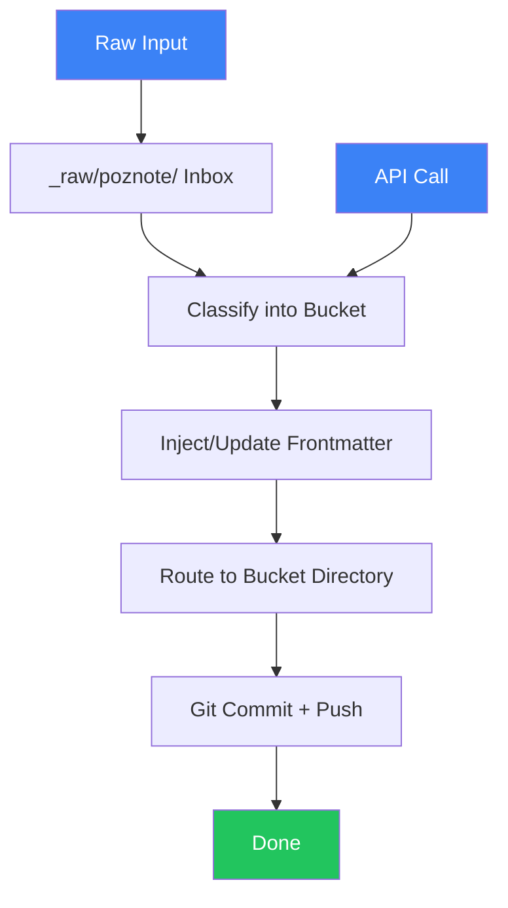

# Poznote Capture Pipeline

## Overview

The Poznote Capture Pipeline is the vault's **ingestion engine**. When a quick note, finding, or raw capture enters the system, the pipeline classifies it into the correct Memory v7.6 bucket, adds proper frontmatter, routes it to the right directory, and commits it to git.

Designed with a **dual-mode architecture** — it works both as an API service (when the Poznote/Pulse daemon is running) and as a file-based processor (watching a local inbox directory). This was a key design insight from the [[concepts/system-prompt-v5-1-1|Antigravity agent]] during the [[journal/2026-07-13-second-brain-integration-session|July 13 session]].

---

## Pipeline Flow



### Steps

1. **Capture** — Note arrives from any source (Poznote mobile app, CLI `wiki-capture`, file dropped in inbox, API call)
2. **Classify** — Pipeline analyzes content keywords to determine Memory v7.6 bucket
3. **Frontmatter** — Standard frontmatter schema is injected or merged with existing metadata
4. **Route** — File is moved from staging to the correct numbered bucket directory
5. **Commit** — Git stages, commits (batched — one commit per run), and optionally pushes

---

## Dual-Mode Architecture

| Mode | Channel | Status |
|------|---------|--------|
| **File mode** | Drop files in `~/poznote-inbox/` or `_raw/poznote/` | ✅ Working |
| **API mode** | POST to Poznote REST API endpoint | ⏳ Untested (Poznote not installed on machine) |

In **file mode**, the pipeline watches `~/poznote-inbox/` (or `_raw/poznote/` within the vault) for new `.md` files, processes them sequentially, then moves them to their target bucket.

In **API mode**, the pipeline serves an HTTP endpoint that accepts capture payloads from mobile or external tools, allowing remote capture directly into the vault.

---

## Frontmatter Schema

Every capture that passes through the pipeline is stamped with this frontmatter:

```yaml
---
title: "Descriptive title (required, used as filename)"
category: "WORK|KNOWLEDGE|LEARNING|RELATIONSHIP|OBSERVABILITY|STATE"
tags:
  - tag1
  - tag2
summary: "One-line summary (populated by classifier if blank)"
lifecycle: "active|archived|draft"
tier: "1|2|3|4|5"
source: "poznote|claude|codex|opencode|hermes|manual"
created: "2025-01-15T10:30:00"
related: []
---
```

### Field Reference

| Field | Required | Values | Default If Missing |
|-------|----------|--------|-------------------|
| `title` | Yes | Free text | Filename stem |
| `category` | No | 6 Memory v7.6 buckets | Auto-classified |
| `tags` | No | String list | `[]` |
| `summary` | No | One sentence | Auto-generated by LLM |
| `lifecycle` | No | `active`, `archived`, `draft` | `active` |
| `tier` | No | 1 (core) → 5 (peripheral) | `2` |
| `source` | No | Tool name | `poznote` |
| `created` | No | ISO 8601 | Current timestamp |
| `related` | No | Wikilink list | `[]` |

### File Naming Rules

- **Title becomes filename**: `My Great Idea` → `My Great Idea.md`
- **Special characters replaced**: `<>:"/\|?*` → `-`
- **Spaces preserved**
- **Case preserved**

---

## Classification Rules

The pipeline auto-classifies based on content keyword matching. If no keywords match, defaults to **KNOWLEDGE**.

| Bucket | Keywords |
|--------|----------|
| **WORK** | task, project, sprint, todo, deadline, milestone |
| **KNOWLEDGE** | concept, theory, research, reference, paper, article |
| **LEARNING** | course, tutorial, lesson, learned, takeaway |
| **RELATIONSHIP** | person, contact, meeting, org, team |
| **OBSERVABILITY** | metric, log, monitor, alert, dashboard |
| **STATE** | config, env, setup, install, version |

---

## Scripts

The pipeline manifests as two scripts in the `second-brain/` project:

```
second-brain/scripts/
├── poznote_pipeline.py   # Core pipeline: capture → classify → commit (dual-mode)
└── poznote_watch.sh      # Cron wrapper for periodic processing
```

### poznote_pipeline.py

The core implementation. Responsible for:

1. **Inbox scanning** — Detects new files in `_raw/poznote/` or `~/poznote-inbox/`
2. **Classification** — Runs keyword analysis against the capture body
3. **Frontmatter injection** — Merges existing metadata with default schema
4. **Bucket routing** — Moves file to the correct `01_WORK/`–`06_STATE/` directory
5. **Git commit** — Stages changes and creates a commit with format: `[poznote] YYYY-MM-DD HH:mm <description>`

The script integrates with the [[concepts/LifeOS Algorithm]] via `hermes_router.py` for task classification when LifeOS Pulse is available.

### poznote_watch.sh

A cron wrapper that periodically runs the pipeline. Designed for:

- **Desktop**: Every 10 minutes via systemd timer or cron
- **Mobile**: Via Termux cron on Android (every 10 minutes)

---

## Git Integration

After pipeline processing, changes are committed to git:

| Property | Value |
|----------|-------|
| **Commit format** | `[poznote] YYYY-MM-DD HH:mm description` |
| **Author identity** | Hermes (`hermes@secondbrain.local`) |
| **Merge strategy** | Rebase |
| **Auto-sync** | Obsidian Git plugin (5-min desktop, 10-min mobile) |

### Conflict Handling

Per the [[06_STATE/configs/sync-strategy|sync strategy config]]:

- **Frontmatter conflicts** → Merge keys (union). `created` keeps earliest. `updated` keeps latest.
- **Body conflicts** → Insert markers. Do not auto-resolve. Flag for manual review.
- **Simultaneous edits** — Mobile captures land in `_raw/poznote/` (append-only, rarely conflicts), desktop deep work goes into final buckets.

---

## Capture Loop

The pipeline completes the knowledge compounding loop first described in [[synthesis/agentic-stack-obsidian-wiki-performance]]:

```
work → wiki-capture --quick (or full) → wiki-ingest promote → wiki-query next session
```

Each session starts by querying knowledge compiled from previous captures — the pipeline is what converts ephemeral notes into durable knowledge.

---

## Open Questions

- Poznote not installed on machine — API mode untested, file mode only
- Mobile sync via Termux cron not yet configured
- No automated classification accuracy metrics
- Relationship between Poznote pipeline and [[concepts/FreeHive|FreeHive API gateway]] unclear — could FreeHive route captures?

## Related

- [[06_STATE/configs/poznote-capture-schema]] — The frontmatter schema definition
- [[concepts/LifeOS Algorithm]] — Task routing that integrates with pipeline
- [[06_STATE/configs/sync-strategy]] — Git merge and conflict rules
- [[06_STATE/configs/second-brain-skill]] — Hook config linking pipeline to LifeOS
- [[concepts/Obsidian Wiki]] — The vault structure receiving captures
- [[synthesis/agentic-stack-obsidian-wiki-performance]] — The capture loop context
